Сигурно знаете, че всяка година държавните институции получават пари от държавния бюджет за да извършват своята дейност. 
А знаете ли, че те отчитат всички направени плащания през специална система, която се нарича СЕБРА. 
Отчетите от СЕБРА са публично достъпни, но информацията в тях е разпокъсана и непоредена. 

Ние, от “Данни за добро”, с помощта на [Института за пазарна икономика](https://ime.bg/)  приехме предизвикателството да обобщим тази информация и да представим ясно, прегледно и организирано за всеки, който се интересува от това колко и за какво се изразходват парите на данъкоплатците.

Изполвайки [приложението за визуализция](https://data-for-good.bg/sebra) можете разберете коя е институцията, която тегли най-много пари в брой или да видите как държавните медии или държавните висши училища изразходват своя бюджет. Нека го разгледаме в детаил.

# Какво е СЕБРА?

TODO

# Приложиението за визуализация

## Видове визуализации

Приложението разполага с няколко вида визуализация.
Между тях се превкключва чрез този панел:

### Обобщение

Обобщението е визуализация, която показва относитлното количество изхарчени средства по институция.
Цветовете отговарят на типа институция.
Размерът на правоъгълниците е пропорционален на сумата на плащането.
Мащабът е динамичен и се настройва автоматично спрямо диапазона на сумите. 

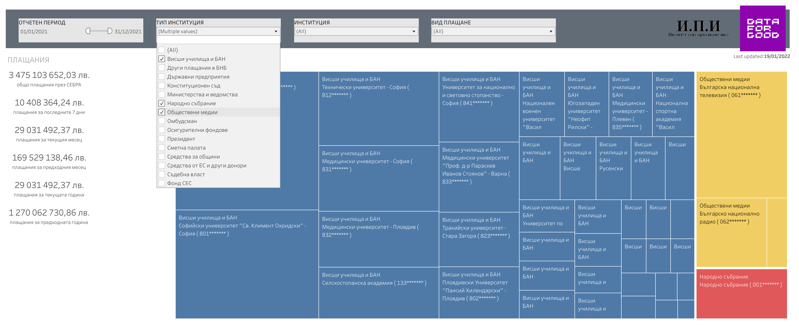
*Пример: Сравнене на разходите за 2021ва на висшите училища и БАН (в синьо), на обществните медии (в жълто) и на народното събрание (в червено).*

### Хронология

Хронологията позволява да се сравнят разходите на дадена институция или набор институции на месечна база между отделните години. 

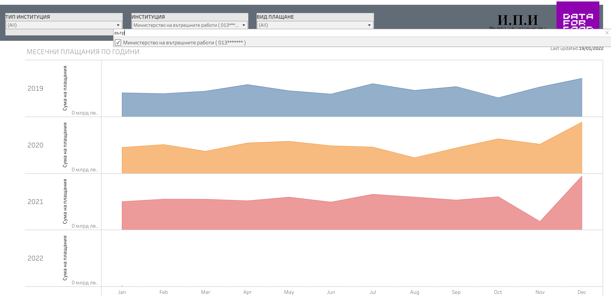
*Пример: Разходите на МВР за 2019, 2020 и 2021*

### Календар

На календара са изобразени плащанията ден по ден. 
Наситеността на оцветяването на отделните дни е пропорционално на сумата на плащанията извършени през съответния ден.

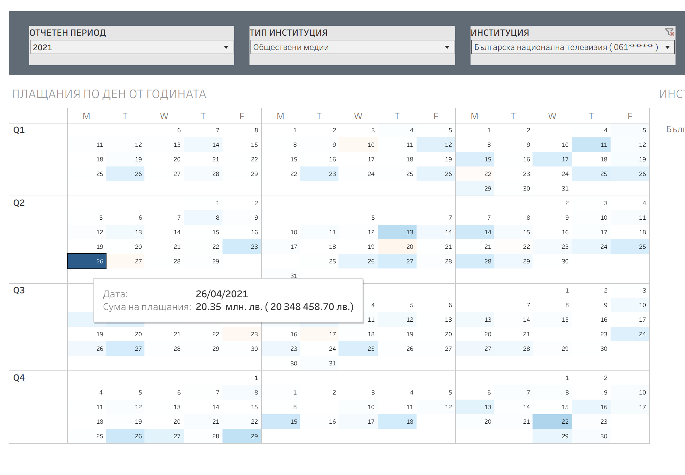
*Пример: БНТ е извършила едно много голямо плащане на 26.04.2021.*

### Месечен Преглед

Месечният преглед позволява да се видят в детаил плащанията за определена институция или набор институции, извършени в рамките на даден месец.
Освен общата сума е показана и разбивка по вид плащане.

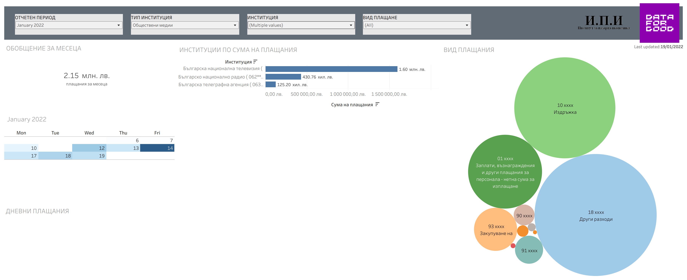
*Пример: На графиката виждаме плащанията за трите обществени медии за месец Януари 2022.*

### Сравнителна Хронология

Сравнителната хронология позволява лесно съпоставяне на разходите във времето на няколко избрани институции.

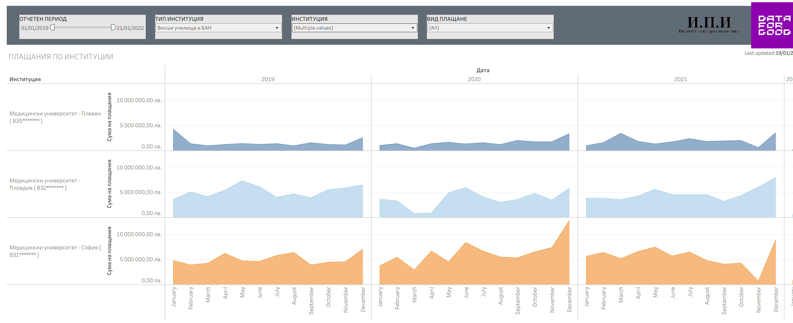
*Пример: Разходите на 3 медицински университета през последните 3 години*

### Сравнение на Институции 

Сравнението на институции позволява да се съпоставят сумите и видовете плащания на две институции за даден период от време.

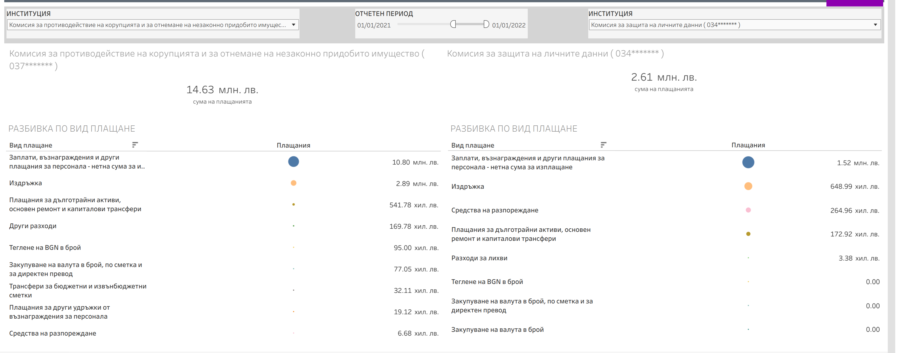
*Пример: Сравнение на рaзходите на КЗЛД и КПКОНПИ за 2021 г. по вид плащане*

## Настройки на визуазлизациите

Визуализациите се настройват и контролират чрез следните инструменти:

### Основен панел 

Основният контролен панел позвлява филтриране на визуализацията по следните четири критерия:

  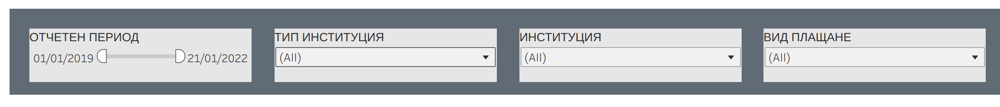

Критериите избрани на панела важат единствено за конкретния режим на визуализация който е избран.
При нужда да се визуализира една и съша селекция чрез няколко визуализации, е нужно да се повторят критериите на всяка една от тях.

### Вторична селекция

* Самите визуализации са интерактивни и позволяват да се изберат един или повече от индивидуалните елементи, които ги съставят.
* Когато са избрани, останлата част от визуализацията също се адаптира така че а отразява селекцията и данните които те представляват.
* Възможен е избора на повече от един елемент чрез задържане на клавиша `control` и повторно щракане с курсура на мишката.
* Възможно е да се изключи даден елемент (негативна селекция) като първо се избере и после се щракне върху `exclude` на поп-ъп прозореца който се появява. 

*Пример 1: Плащания по институции на 1 конкретна дата.*
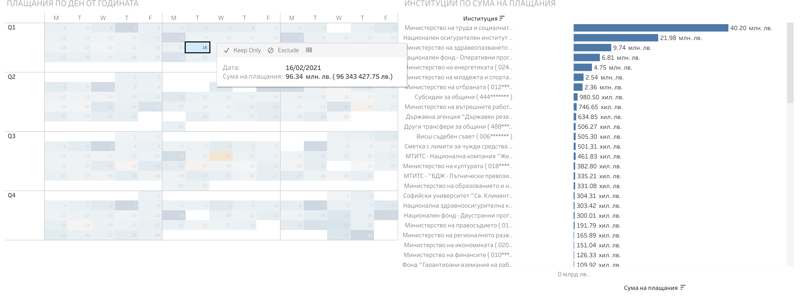

*Пример 2: Плащанията на НОИ се извършват на 7-мо число всеки месец.*
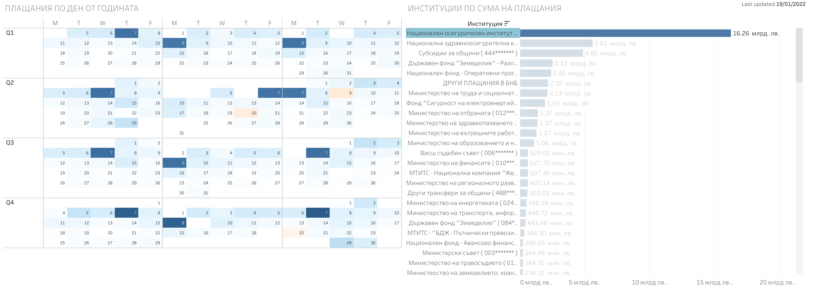

### Долен панел

Долният панел съдържа няколко полезни функции:

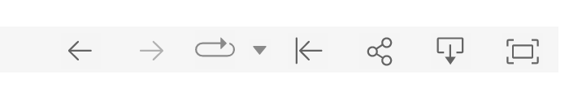

* *Undo/Redo* : Отмяна/Повторение на действие
* *Reset* : Отмяна на всички действия
* *Share* : Споделяне на текущата визуализация и селекция като линк ([пример](https://public.tableau.com/shared/CW2R9NS6K?:display_count=y&:origin=viz_share_link&:embed=y))
* *Download* : Изтегляне на текущата визуализация като картинка или наборът данни на който тя отговаря в табличен вид (виж по долу).
* *Full Screen* : Показване на визуалзацията на цял екран. 

# Отворени данни

## Входни данни

Данните върху които се базира инструмента се публикуват ежедневно на [уебсайта](https://www.minfin.bg/bg/transparency) на Министерството на финансите.
Макар и достъпни, изходният им формат се подава трудно на обработка и анализ и окрупняване.  

## Обработени данни

Обработката им се осъществява от тази програма, [достъпна като отворен код в github](https://github.com/data-for-good-bg/sebra-scrape)
Резултатът от обработката във вид на машинно-четима таблица с всички плащания в СЕБРА от 01.01.2019 е достъпна на [този линк](https://docs.google.com/spreadsheets/d/1VoB4dIH2Y2x2O-eH0ivNmBUYCcT-1NR6T5h8eWkE33Y/gviz/tq?tqx=out:csv&gid=1639699984).
Това са и данните върху които върви приложението
Те се обновяват ежедневно, според ритъма на публикуване на данни на сайта на министерството на финансите.

**Предвид че са резултат на немалко автоматизирана обработка е възможно да има технически грешки. При несъответвие като авторитетни се приемат данните такива каквито са публикувани от институциите.** 

## Извличане на данни чрез приложението

Самото приложение позволява да се издърпа определена селекция от данни. 

Това става по следния начин
1. Щраква се на бутона `download` на долния панел 
2. От менто се избира `DATA`
3. От новия прозорец се избира 2-рия таб `sebra_data`
4. По желание се щраква на `show all colums`
5. Избира се `Download all rows as a text file`

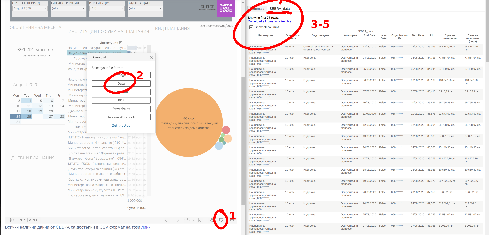
*Пример: Извличане на данните отговарящи на плащанията на НЗОК за месец август 2020*

# За Финал

Това приложение е плод на часове напълно безвъзмезден труд на доброволците на сдружение "Данни за Добро". 
Употребата му е безплатна и всякави резултати от него могат да се използват сългасно условията на отворения лиценз [CC-BY](https://creativecommons.org/licenses/by/2.5/bg/)

Можете да се свържете с нас на [info@data-for-good.bg](mailto:info@data-for-good.bg)